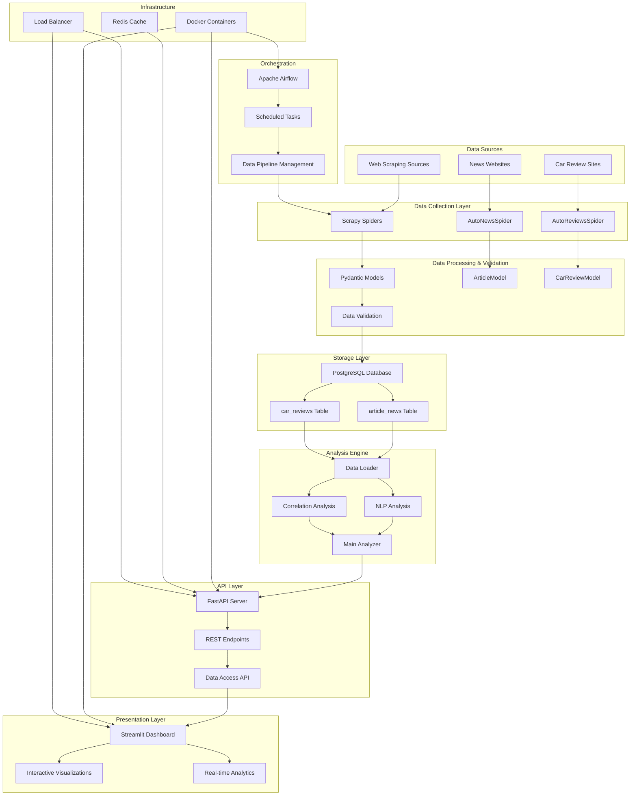

# Auto Intel Project - System Architecture

## 🏗️ System Architecture Overview



## 📊 Data Flow Architecture

### Phase 1: Data Collection
```
Web Sources → Scrapy Spiders → Raw Data
```

**Components:**
- **Scrapy Framework**: Web scraping engine
- **AutoNewsSpider**: Extracts automotive news articles
- **AutoReviewsSpider**: Extracts car review data
- **Data Sources**: Automotive news websites and review platforms

### Phase 2: Data Validation & Storage
```
Raw Data → Pydantic Validation → PostgreSQL Database
```

**Components:**
- **Pydantic Models**: Data validation and serialization
  - `ArticleModel`: Validates news article structure
  - `CarReviewModel`: Validates car review structure
- **PostgreSQL Pipeline**: Database insertion with conflict handling
- **PostgreSQL Database**: Persistent storage with optimized schema

### Phase 3: Data Analysis
```
Stored Data → Analysis Engine → Insights
```

**Components:**
- **Data Loader**: CSV loading and preprocessing
- **NLP Analysis**: 
  - Bigrams & Trigrams extraction
  - Named Entity Recognition (brands, locations, models)
  - Sentiment Analysis (VADER)
  - Topic Modeling
- **Correlation Analysis**:
  - Price vs Rating correlations
  - Sentiment vs Score correlations
  - News vs Reviews correlations
  - Time series analysis
- **Main Analyzer**: Orchestrates all analysis components

### Phase 4: Data Presentation
```
Insights → API/Dashboard → User Interface
```

**Components:**
- **FastAPI Server**: RESTful API endpoints
- **Streamlit Dashboard**: Interactive web application
- **Real-time Visualizations**: Charts, graphs, and metrics

### Phase 5: Orchestration & Deployment
```
Scheduled Tasks → Airflow DAGs → Automated Pipeline
```

**Components:**
- **Apache Airflow**: Workflow orchestration
- **Docker Containers**: Containerized services
- **CI/CD Pipeline**: Automated testing and deployment

## 🔧 Technical Stack

### Backend Technologies
- **Python 3.11+**: Core programming language
- **Scrapy**: Web scraping framework
- **FastAPI**: Modern web API framework
- **PostgreSQL**: Primary database
- **Redis**: Caching layer
- **Apache Airflow**: Workflow orchestration

### Data Science & Analytics
- **Pandas**: Data manipulation and analysis
- **NumPy**: Numerical computing
- **NLTK**: Natural language processing
- **spaCy**: Advanced NLP and NER
- **VADER**: Sentiment analysis
- **Matplotlib/Seaborn**: Data visualization
- **Plotly**: Interactive visualizations

### Frontend & Presentation
- **Streamlit**: Interactive dashboard framework
- **HTML/CSS/JavaScript**: Web interface components

### Infrastructure & DevOps
- **Docker**: Containerization
- **Docker Compose**: Multi-container orchestration
- **GitHub Actions**: CI/CD pipeline
- **Uvicorn**: ASGI server for FastAPI

## 📈 Scalability Considerations

### Horizontal Scaling
- **Load Balancer**: Distributes traffic across multiple API instances
- **Database Replication**: Read replicas for improved performance
- **Redis Cluster**: Distributed caching for high availability

### Performance Optimization
- **Data Caching**: Redis for frequently accessed data
- **Database Indexing**: Optimized queries for large datasets
- **Async Processing**: Non-blocking operations for better throughput
- **Batch Processing**: Efficient handling of large data volumes

### Monitoring & Logging
- **Application Logs**: Structured logging for debugging
- **Performance Metrics**: Response times, throughput monitoring
- **Error Tracking**: Comprehensive error handling and reporting
- **Health Checks**: Service availability monitoring

## 🔒 Security Architecture

### Data Protection
- **Input Validation**: Pydantic models ensure data integrity
- **SQL Injection Prevention**: Parameterized queries
- **CORS Configuration**: Controlled cross-origin access
- **Environment Variables**: Secure configuration management

### Access Control
- **API Authentication**: Token-based access control
- **Rate Limiting**: Protection against abuse
- **Input Sanitization**: XSS and injection attack prevention

## 🚀 Deployment Architecture

### Development Environment
```
Local Development → Git Repository → CI/CD Pipeline
```

### Production Environment
```
CI/CD Pipeline → Docker Registry → Production Cluster
```

### Container Orchestration
- **Docker Compose**: Local development and testing
- **Kubernetes**: Production deployment (optional)
- **Cloud Platforms**: AWS, Azure, or GCP deployment ready

## 📋 System Requirements

### Minimum Requirements
- **CPU**: 2 cores
- **RAM**: 4GB
- **Storage**: 20GB
- **Network**: Stable internet connection

### Recommended Requirements
- **CPU**: 4+ cores
- **RAM**: 8GB+
- **Storage**: 50GB+ SSD
- **Network**: High-speed internet connection

## 🔄 Data Pipeline Schedule

### Automated Tasks
- **Daily**: Data scraping and analysis
- **Weekly**: Comprehensive correlation analysis
- **Monthly**: System maintenance and optimization

### Manual Tasks
- **On-demand**: Custom analysis requests
- **Ad-hoc**: Data quality checks and validation

---

*This architecture ensures a robust, scalable, and maintainable system for automotive data intelligence and analysis.*
